# M1 模块图与需求追溯（pic.md）

请各小组在改进大作业过程文档时注意以下几点：
1）请大家检查各文档的内容是否齐全，尤其是需求说明书、概要/详细设计说明书、测试报告，需求说明书应包含用例描述、用例图、系统顺序图、概念类图等UML图，概要设计有组件图、组件顺序图等，详细设计有活动图、状态图等。若不清楚需要哪些图请仔细复习课件。
2）请在测试报告中写清楚测试用例，可以参考下方给出的示例。
3）考虑到普遍存在交付文档之间内容不一致的问题，请大家制作一份需求追溯表，统计整个项目一共有几个子系统，包含模块数、用例数、系统操作数以及之间的对应关系，绘制需求追溯矩阵（Requirements Traceability Matrix, RTM），保证需求—设计—开发—测试之间一致且连贯

## 一、适用范围

本文档以 **M1：主体框架与运营管理模块** 的图示补齐为主，同时补充 **全项目（M1-M6）需求追溯矩阵**，用于和《需求划分文档》《软件开发计划书》《软件详细设计说明书》《测试文档》保持一致。

M1 职责范围：

- 用户注册 / 登录 / 登出
- JWT 身份认证与路由守卫
- 全局响应式布局
- API 请求封装与全局错误处理
- 超级管理员仪表盘
- 后台产品管理
- 后台订单总览与干预
- 后台用户管理
- 公共组件库

---

# 二、M1 用例描述

## 2.1 参与者

- **游客**：未登录用户
- **普通用户**：已登录普通用户
- **管理员**：已登录且具有 ADMIN 权限的用户
- **系统**：前端 + 后端 + 数据库 + JWT 认证机制

## 2.2 M1 用例清单

| 用例编号 | 用例名称 | 参与者 | 简要说明 |
|---|---|---|---|
| UC-M1-01 | 用户注册 | 游客 | 用户通过邮箱验证码完成注册，系统创建用户并分配默认普通用户角色 |
| UC-M1-02 | 用户登录 | 游客 | 用户输入账号、密码、验证码并勾选隐私政策后登录，系统返回 JWT |
| UC-M1-03 | 用户登出 | 普通用户 / 管理员 | 用户主动退出，前端清理本地登录态 |
| UC-M1-04 | 访问受保护页面 | 普通用户 / 管理员 | 通过 JWT 与路由守卫控制页面访问权限 |
| UC-M1-05 | 查看管理员仪表盘 | 管理员 | 管理员查看总用户数、总订单数、累计营收、趋势图、热门产品 |
| UC-M1-06 | 管理产品 | 管理员 | 上下架产品、调价、调库存 |
| UC-M1-07 | 管理订单 | 管理员 | 查看订单列表，手动取消、退款、修改状态 |
| UC-M1-08 | 管理用户 | 管理员 | 搜索用户、封禁/解封、调整等级 |
| UC-M1-09 | 查看操作日志 | 管理员 | 查看后台操作记录，按操作类型和结果筛选 |
| UC-M1-10 | 统一错误处理与提示 | 系统 | 前端和后端对接口异常进行统一处理并返回可理解提示 |

---

# 三、M1 用例图

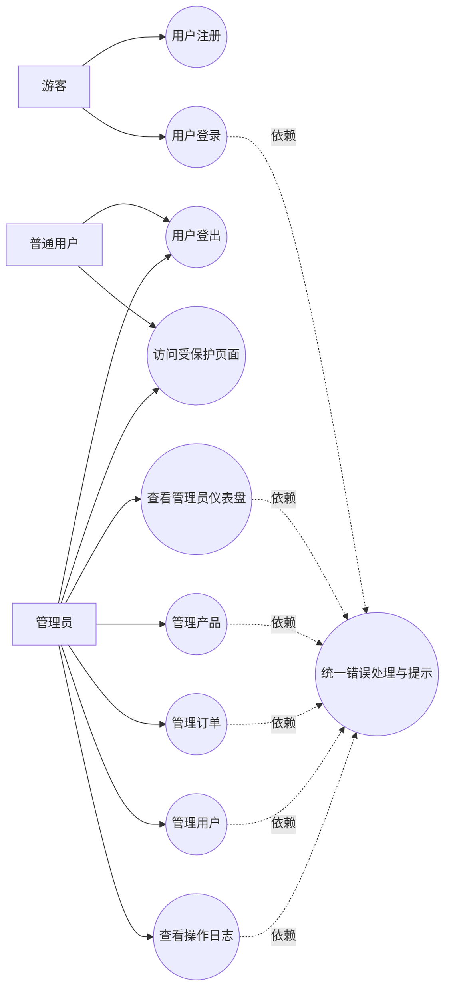

---

# 四、M1 系统顺序图（SSD）

## 4.1 用户登录 SSD

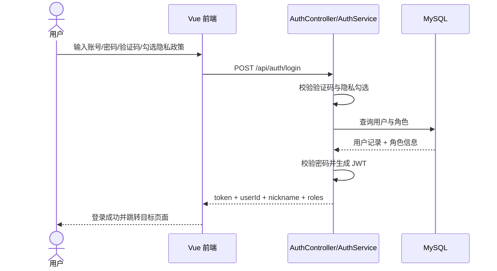

## 4.2 管理员产品管理 SSD

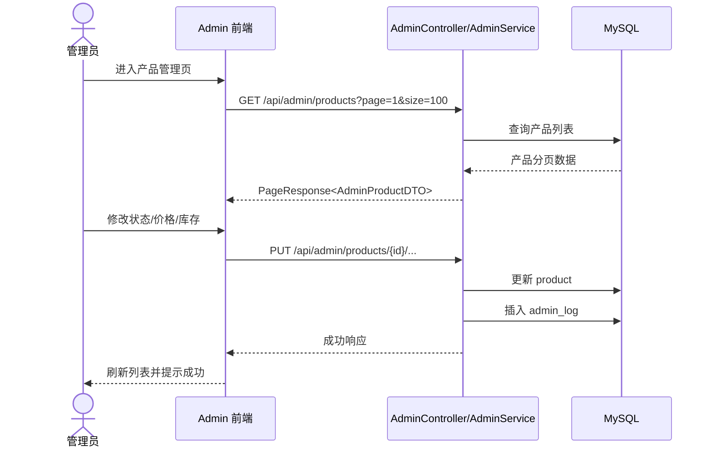

## 4.3 管理员订单干预 SSD

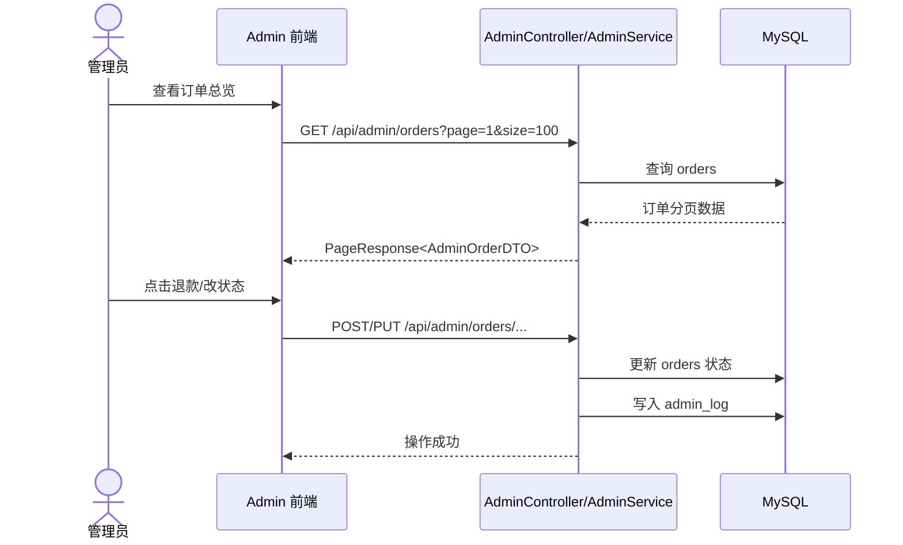

---

# 五、M1 概念类图

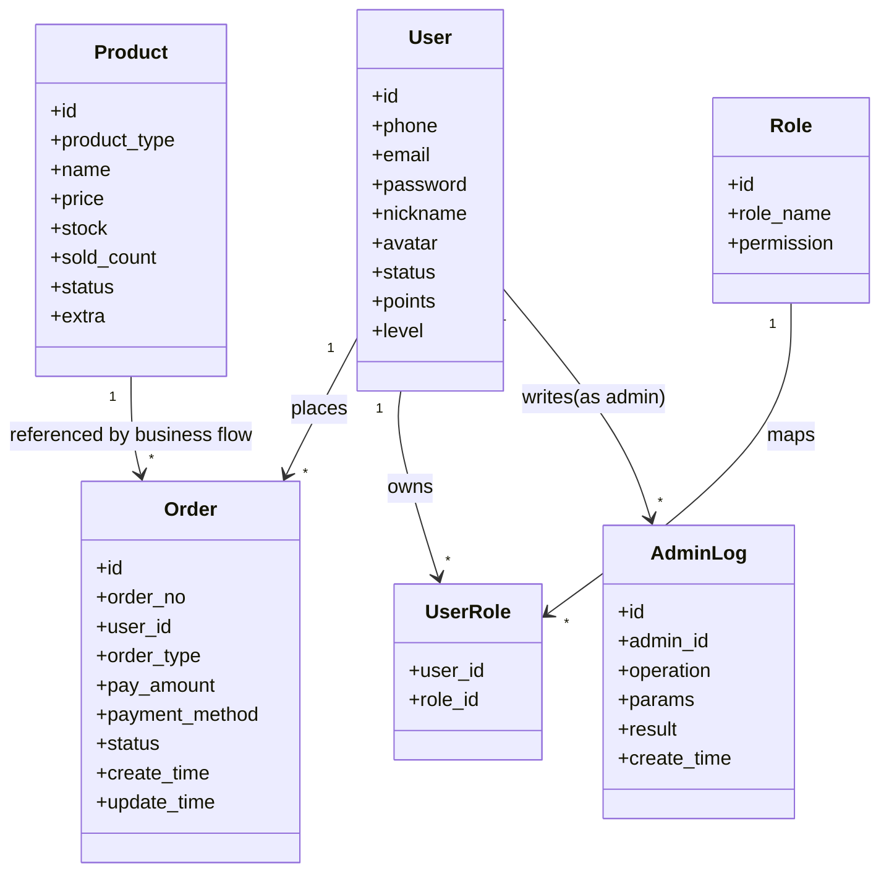

---

# 六、M1 组件图（概要设计）

| 图中的节点/连线                                   | 选哪个图例                         |
| :------------------------------------------------ | :--------------------------------- |
| 三大框（Frontend / Backend / DB）                 | **Component**（组件）              |
| Controller、Service、JwtService、ExceptionHandler | **Class**（类）                    |
| Vue页面、Router、Store、Axios封装                 | **Artifact**（制品）               |
| user / role / product 等数据库表                  | **Class**（类，带 `<<entity>>`）   |
| 所有 `-->` 连线（调用/使用）                      | **Dependency**（依赖）             |
| 后端暴露的 RESTful API                            | **Provided Interface**（提供接口） |
| 前端依赖的后端 API 定义                           | **Required Interface**（需求接口） |

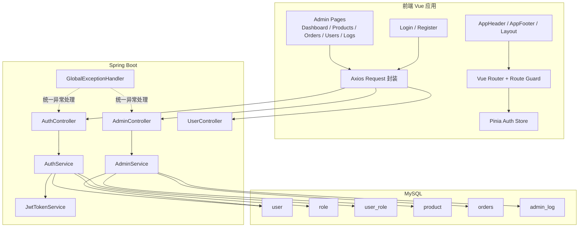

---

# 七、M1 组件顺序图

## 7.1 登录与路由守卫组件顺序图

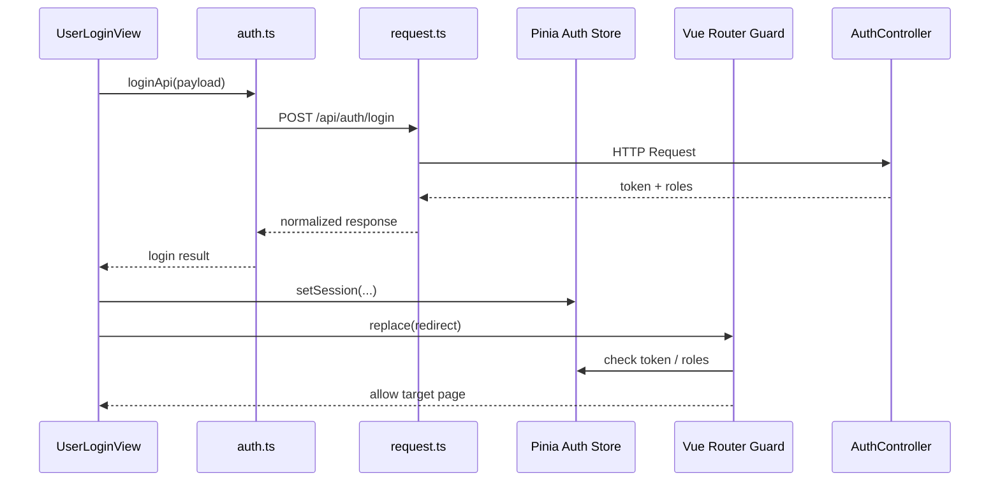

## 7.2 管理后台数据列表顺序图

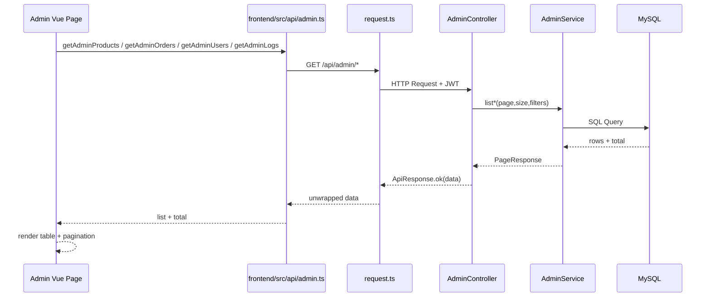

---

# 八、M1 活动图（详细设计）

## 8.1 用户注册 / 登录活动图

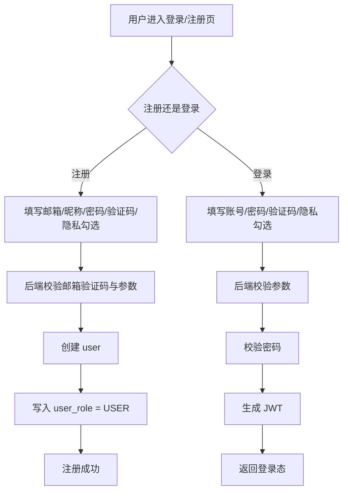

## 8.2 管理员后台操作活动图

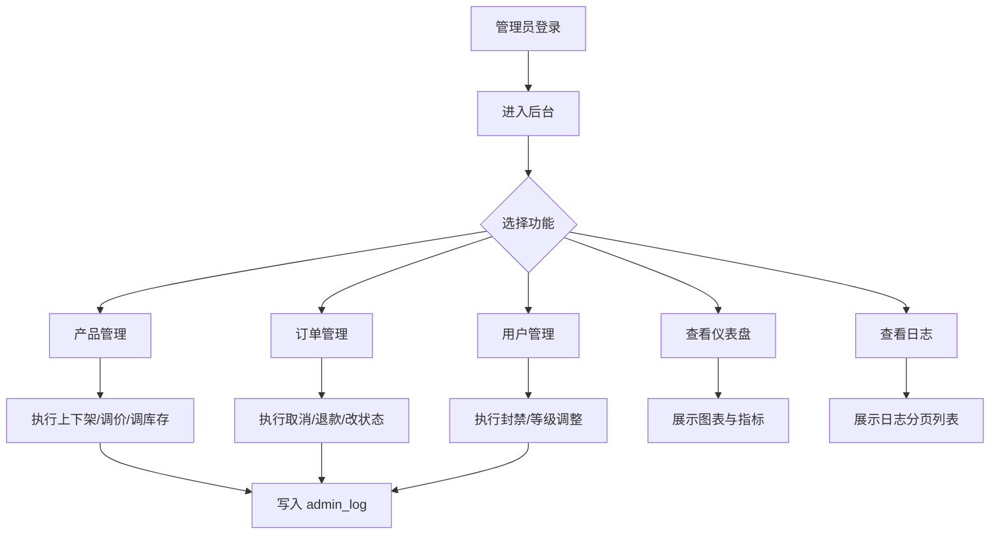

## 8.3 全局错误处理活动图

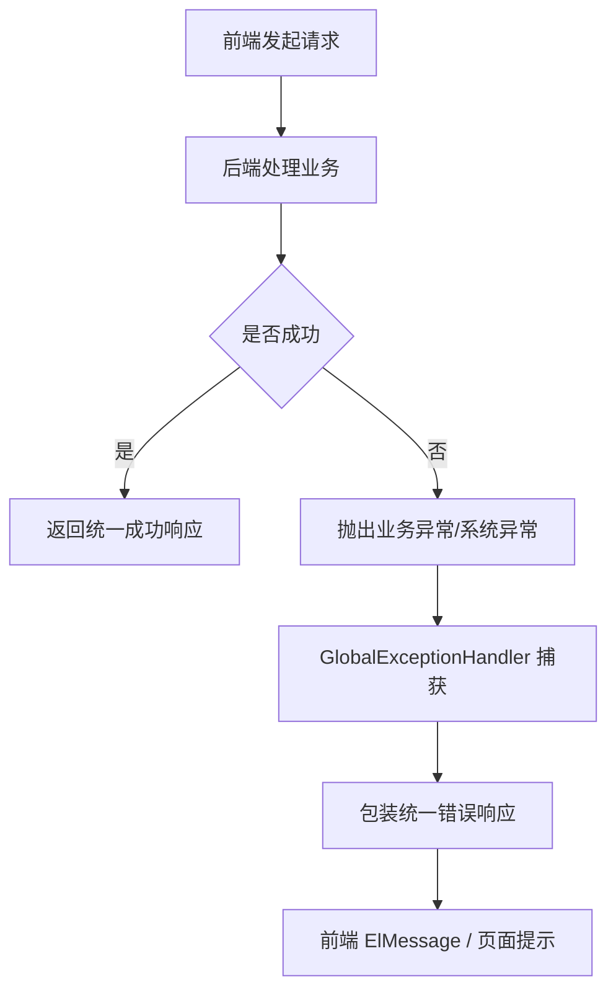

---

# 九、M1 状态图（详细设计）

## 9.1 用户认证状态图

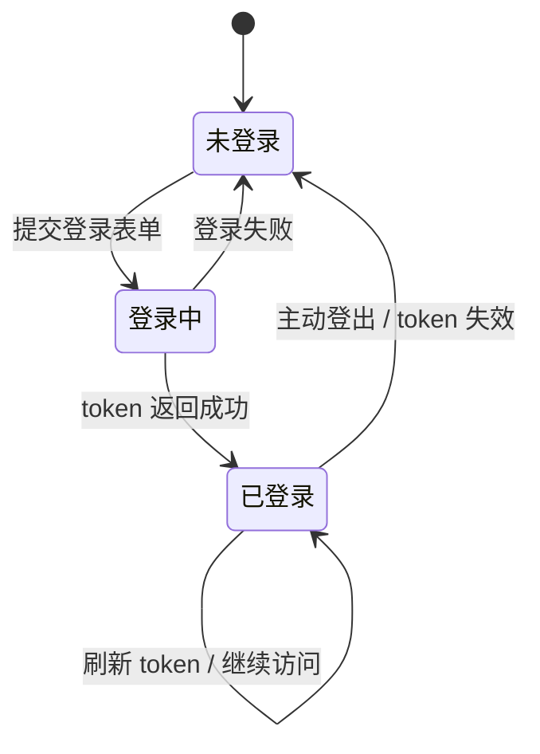

## 9.2 管理员订单干预状态图（M1 管理角度）

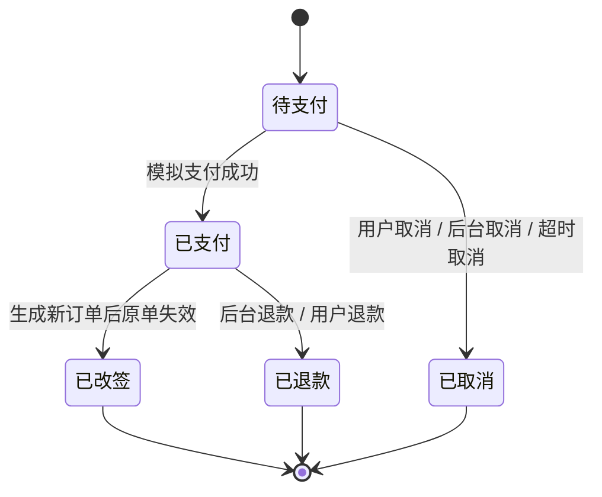

---

# 十、M1 需求追溯表（Requirements Traceability Table）

## 10.1 M1 功能点与设计 / 实现 / 测试追溯

| 需求ID | 功能点 | 设计位置 | 主要实现位置 | 测试位置 |
|---|---|---|---|---|
| M1-R1 | 用户注册/登录/登出 | `docs/软件详细设计说明书.md` M1 章节 | `backend/controller/AuthController.java`、`backend/service/AuthService.java`、`frontend/views/auth/UserLoginView.vue`、`frontend/stores/auth.ts` | `docs/测试文档.md` 认证模块；`backend/src/test` 认证相关测试 |
| M1-R2 | JWT 身份认证与路由守卫 | `docs/软件详细设计说明书.md` M1 章节 | `backend/JwtTokenService.java`、`frontend/router/index.ts`、`frontend/utils/auth.ts` | `docs/测试文档.md` 认证与权限控制 |
| M1-R3 | 全局响应式布局 | `docs/软件详细设计说明书.md` M1 章节 | `frontend/App.vue`、`frontend/components/AppHeader.vue`、`frontend/components/AppFooter.vue`、`frontend/assets/styles` | 人工端到端测试 |
| M1-R4 | API 请求封装与全局错误处理 | `docs/软件详细设计说明书.md` M1 章节 | `frontend/utils/request.ts`、`backend/exception/GlobalExceptionHandler.java` | `docs/测试文档.md` 接口异常与统一响应 |
| M1-R5 | 超级管理员仪表盘 | `docs/软件详细设计说明书.md` M1 章节 | `frontend/views/admin/DashboardView.vue`、`backend/controller/AdminController.java`、`backend/service/AdminService.java` | `docs/测试文档.md` 管理后台模块 |
| M1-R6 | 后台产品管理 | `docs/软件详细设计说明书.md` M1 章节 | `frontend/views/admin/ProductManageView.vue`、`backend/controller/AdminController.java`、`backend/service/AdminService.java` | `AdminApiIntegrationTests`、人工回归 |
| M1-R7 | 后台订单总览与干预 | `docs/软件详细设计说明书.md` M1 章节 | `frontend/views/admin/OrderManageView.vue`、`backend/controller/AdminController.java`、`backend/service/AdminService.java` | `docs/测试文档.md` 后台订单测试 |
| M1-R8 | 后台用户管理 | `docs/软件详细设计说明书.md` M1 章节 | `frontend/views/admin/UserManageView.vue`、`backend/controller/AdminController.java`、`backend/service/AdminService.java` | `docs/测试文档.md` 后台用户管理测试 |
| M1-R9 | 公共组件库 | `docs/软件详细设计说明书.md` M1 章节 | `frontend/components/`、`frontend/assets/styles/` | 人工测试 + 构建测试 |
| M1-R10 | 操作日志与审计 | `docs/软件详细设计说明书.md` M1 章节 | `frontend/views/admin/TableBrowserView.vue`、`backend/dto/module/AdminLogDTO.java`、`backend/service/AdminService.java` | 管理后台接口测试 / 人工测试 |

---

# 十一、全项目需求追溯矩阵（RTM）

## 11.1 统计汇总

| 统计项 | 数量 | 说明 |
|---|---:|---|
| 子系统数 | 6 | M1 ~ M6 |
| 模块数 | 6 | 主体框架、用户中心与AI、机票、酒店、火车票+度假、智能行程+社区 |
| 功能点数 | 55 | 依据《需求划分文档》中的功能点统计 |
| 用例数 | 55 | 按每个功能点至少对应一个主用例统计 |
| 主要系统操作数 | 70+ | 包含查询、下单、支付、退款、改签、AI 生成、后台管理等关键操作 |

## 11.2 RTM 矩阵

| 模块 | 需求ID | 代表功能点 | 用例 / 操作 | 设计说明 | 主要实现位置 | 测试验证 |
|---|---|---|---|---|---|---|
| M1 主体框架与运营管理 | M1-R1 ~ M1-R10 | 认证、JWT、全局布局、后台仪表盘、产品/订单/用户/日志管理 | 注册、登录、登出、鉴权访问、后台干预 | `docs/软件详细设计说明书.md` 2.1 | `AuthController`、`AuthService`、`AdminController`、`AdminService`、`frontend/views/admin/*` | `docs/测试文档.md` 认证模块、后台模块、`AdminApiIntegrationTests` |
| M2 用户中心与 AI 智能助手 | M2-R1 ~ M2-R9 | 个人资料、常用出行人、积分、会员、安全设置、我的订单、智能客服、语音输入、自然语言修改信息 | 查看个人中心、修改资料、维护出行人、查看订单、AI 对话 | `docs/软件详细设计说明书.md` 2.2 | `UserController`、`UserService`、`UserCenterView.vue`、`conversation` / AI 相关 service | `docs/测试文档.md` 用户中心模块、AI 模块、人工回归 |
| M3 机票预订 | M3-R1 ~ M3-R9 | 航班搜索、排序筛选、价格日历、舱位与附加服务、下单、支付、退改签、自然语言搜索、智能解释 | 搜索航班、创建订单、支付、退款、改签、生成退改签解释 | `docs/软件详细设计说明书.md` 2.3 | `FlightsView.vue`、`FlightSearchService`、`PublicApiController` | `FlightSearchApiIntegrationTests`、人工测试、测试文档机票模块 |
| M4 酒店预订 | M4-R1 ~ M4-R9 | 酒店搜索、地图/列表、筛选、房型详情、入住人下单、订单/发票、取消、AI 推荐、评论摘要 | 搜索酒店、查看房型、下单、支付、取消、发票、评价 | `docs/软件详细设计说明书.md` 2.4 | `HotelController`、`HotelServiceImpl`、`frontend/views/hotel/*` | `docs/测试文档.md` 酒店模块、人工回归 |
| M5 火车票 + 旅游度假 | M5-R1 ~ M5-R10 | 火车票查询、坐席、学生票/儿童票、支付、退票、改签、度假搜索、度假预订、合同、AI 文案与行程助手 | 火车直达/中转、购买、支付、退票、改签、度假预订、详情文案、行程助手 | `docs/软件详细设计说明书.md` 2.5 | `TrainController`、`OrderController`、`OrderServiceImpl`、`TrainMcpClient`、`VacationServiceImpl`、`TrainsView.vue`、`VacationsView.vue` | `docs/测试文档.md` 火车票与度假模块、人工回归、相关 controller/service 测试 |
| M6 智能行程与社区 | M6-R1 ~ M6-R11 | 行程规划、导出、提醒、评价、游记、评论、问答、当地玩乐、AI 行程生成、AI 游记、评论情感分析、社区机器人 | AI 生成行程、保存行程、发布游记、点赞评论、提问回答 | `docs/软件详细设计说明书.md` 2.6 | `ItineraryView.vue`、`CommunityView.vue`、`ItineraryService`、`CommunityServiceImpl`、AI 相关 controller/service | `M6ItineraryCommunityIntegrationTests`、`docs/测试文档.md` 行程社区模块 |

---

# 十二、M1 说明与使用建议

1. 本文件中的图优先服务于课程过程文档补齐，采用 Mermaid 文本图方便直接纳入 Markdown 文档版本管理。
2. 若最终提交要求严格使用 UML 图形工具（如 StarUML、PlantUML、Visio），可以此文中的 Mermaid 结构作为草图进行转绘。
3. RTM 用于解决“需求—设计—实现—测试不一致”的问题，后续其他模块（M2-M6）可按同样格式继续扩展。
4. 当前内容聚焦你负责的 M1，和 `docs/软件开发计划书.md`、`docs/需求划分文档.md`、`docs/软件详细设计说明书.md`、`docs/测试文档.md` 保持一致，不引入与现有实现冲突的新功能描述。
