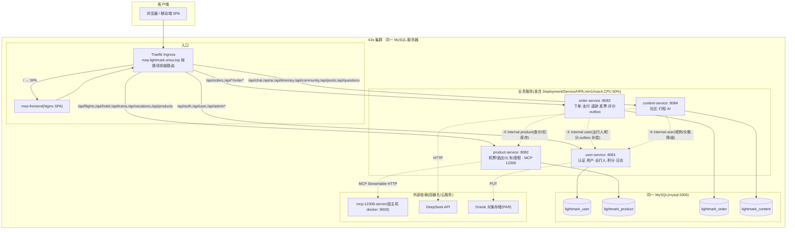
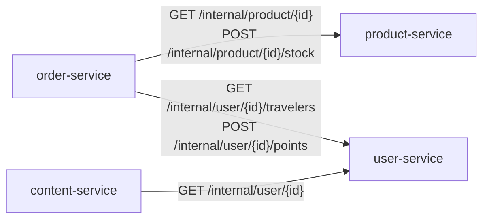

# 微服务划分(单体对照与设计实现说明)

> 版本基线:仓库 `msa-develop` 分支当前代码(2026-09)。
> 本文是**实现现状版**:服务划分、接口清单、表归属与跨服务调用均以 msa 代码与线上部署为准,
> 与规划文档 `docs/微服务拆分方案.md` 配套使用(规划版描述目标,本文记录落地事实)。
> 服务划分图归档件:`提交材料/02_docs/服务划分图.png`(答辩材料同图)。

---

## 1. 改造背景与对照对象

### 1.1 单体后端(改造前,`monolith-start` 冻结)

| 维度 | 单体现状 |
| --- | --- |
| 进程 | 单个 Spring Boot 后端(backend),8080 端口 |
| 数据库 | 单 MySQL 库 `lightmark`,20 张业务表 + Flyway 历史表 |
| 路由 | 所有 `/api/*` 由同一后端处理 |
| 数据访问 | **通用 CRUD 直连任意表**:`CrudController/{table}`、`ModuleController/{module}`、`GenericCrudService`(代码实测存在,`backend/src/main/java/.../controller/CrudController.java` 等) |
| 认证 | 后端内统一 JWT 签发/校验 |
| 故障边界 | 单一进程,任一模块异常影响整体;无法独立扩缩容 |

### 1.2 单体核心问题(拆分动机)

1. 通用 CRUD 使表与业务无归属约束,表结构变更缺乏收口;
2. 单体无法按业务域独立构建/测试/部署/扩缩容(任务书要求 ≥3 业务微服务独立部署);
3. 无法做故障隔离与按域的云原生实验(HPA/熔断针对单一进程无意义)。

### 1.3 拆分后目标架构

同一 MySQL 服务器、4 个独立 schema、4 个业务微服务 + 独立前端 + 网关层入口:

```
客户端/浏览器
   │ HTTPS(HTTP :80 内网可用)
   ▼
Traefik Ingress(k3s)——按域名/Host + 路径前缀路由
   ├── lightmark.ortus.top ──► 单体(对照,monolith-start 保留)
   └── msa.lightmark.ortus.top ──► 4 个微服务 + msa-frontend(SPA)
```

---

## 2. 服务划分总览与划分理由

| 服务 | 端口 | 职责(业务域) | 划分理由 | 独立部署 |
| --- | --- | --- | --- | --- |
| **user-service** | 8081 | 认证/验证码、用户资料、角色权限、出行人、积分会员、登录与管理员日志、头像对象存储 | 用户身份是全系统信任根,高内聚(认证令牌由本服务签发,其余服务只校验);会话型接口集中于此 | ✅ |
| **product-service** | 8082 | 机票/酒店/火车票/度假产品目录、房型、浏览记录、12306 火车票查询(MCP) | 只读型产品域,读写频次高,便于独立横向扩缩容与缓存/压测 | ✅ |
| **order-service** | 8083 | 各产品下单、支付、退款、改签、发票、评价、outbox 补偿 | 交易域含状态机与补偿逻辑,依赖 product/user 的**接口**而非表 | ✅ |
| **content-service** | 8084 | 社区游记/点赞/评论/问答、智能行程、AI 对话(DeepSeek) | 内容域独立增长,AI 调用故障只降级不影响交易 | ✅ |

划分原则:按业务域而非按用例数机械拆分;每张表唯一归属;跨服务只走接口;不做跨库联表查询。

---

## 3. 服务划分图

### 3.1 部署与路由拓扑



### 3.2 服务间调用关系(仅 3 条业务链路)



> 归档图件(答辩材料同图):`提交材料/02_docs/服务划分图.png`;本文 mermaid 为可编辑源文本。

---

## 4. 服务接口清单

> 访问控制说明(以拦截器配置为准):user-service 对 `/api/user/**`、`/api/admin/**`、`/internal/user/**` 强制 JWT;
> order/product/content 对 `/internal/**` 强制 JWT;`/api/**` 公开,部分写接口在方法内按 Authorization 校验。
> `/internal/*` 为服务间内部接口,入口层(Ingress)不暴露。

### 4.1 user-service(8081,域前缀 `/api/auth`、`/api/user`、`/api/admin`)

| 方法 | 路径 | 访问 | 说明 |
| --- | --- | --- | --- |
| GET | /api/auth/captcha | 公开 | 图形验证码(会话存储) |
| POST | /api/auth/verification/email/send | 公开 | 发送邮箱验证码(需图形验证码) |
| POST | /api/auth/register | 公开 | 注册(邮箱+验证码) |
| POST | /api/auth/login | 公开 | 登录(账号/密码/图形验证码),签发 JWT |
| POST | /api/auth/admin/login | 公开 | 后台登录(免图形验证码,校验 ADMIN) |
| POST | /api/auth/logout | 登录 | 登出 |
| GET/PUT | /api/user/current | 登录 | 当前用户信息 |
| POST | /api/user/{id}/profile | 登录 | 修改资料 |
| POST/PUT | /api/user/{id}/password、/api/user/password | 登录 | 修改密码 |
| POST | /api/user/avatar、/api/user/avatar/upload | 登录 | 头像 URL / 上传(转 JPEG → Oracle 对象存储) |
| GET/POST/PUT/DELETE | /api/user/travelers、/api/user/{id}/travelers、/api/user/travelers/{id} | 登录 | 常用出行人 CRUD |
| GET | /api/user/points/logs、/api/user/{id}/points | 登录 | 积分流水/积分查询 |
| GET | /api/user/level/upgrade-info | 登录 | 会员升级信息 |
| GET | /api/admin/users、/api/admin/logs | 管理员 | 用户管理、操作日志 |
| PUT | /api/admin/users/{id}/status、/level | 管理员 | 启停/会员等级 |
| GET/POST | /internal/user/{id}、/{id}/travelers、/{id}/points | 内部 | 脱敏资料/出行人校验/积分增减 |
| GET | /api/health、/api/ready、/api/version | 公开 | 健康/就绪(含 DB 探活)/版本 |

### 4.2 product-service(8082,域前缀 `/api/flights|hotel|hotels|trains|vacations|products|legacy`)

| 方法 | 路径 | 说明 |
| --- | --- | --- |
| GET | /api/flights/search、/api/flights/price-calendar、/api/flights/{id} | 机票搜索/价格日历/详情(机场码↔城市码归一化匹配) |
| GET | /api/hotel/list、/api/hotels/search、/api/hotel/{id}、/api/hotel/room/{id}、/api/hotel/{id}/rooms | 酒店搜索(关键词)/列表别名/详情/房型/房型列表 |
| GET | /api/vacations、/api/vacations/options、/api/vacations/{id} | 度假产品列表/筛选项/详情 |
| POST/GET | /api/trains/search、/api/trains/transfer/search、/api/trains/calendar、/api/trains/options、/api/trains/detail/{id} | 火车票搜索(经 MCP 12306)/中转/日历/**站点选项(全量 station.csv)** |
| GET/POST | /api/products、/api/products/{id}、/api/products/{id}/views | 全品类产品分页/详情/浏览记录 |
| POST/GET | /api/legacy/vacations/search | 兼容旧路由 |
| GET/POST/PUT/DELETE | /api/admin/products | 产品管理(列表/新建/上下架/调价/库存/删除) |
| GET/POST | /internal/product/{id}、/internal/product/{id}/stock | 内部:详情/扣减或回补库存 |
| GET | /api/health | 健康检查 |

> 注:机票搜索对"机场码(PEK/PKX/NAY)/城市码(BJS)/中文城市名"均归一化匹配,与单体行为一致(2026-09 修复)。

### 4.3 order-service(8083,域前缀 `/api/orders`、`/api/*/order*`)

| 方法 | 路径 | 说明 |
| --- | --- | --- |
| POST | /api/flights/order/preview、/api/flights/order | 机票试算/下单 |
| POST | /api/hotel/order | 酒店下单 |
| POST | /api/trains/order、/api/vacations/order | 火车/度假下单 |
| POST | /api/orders/{orderNo}/pay、/payment/callback | 支付/回调 |
| POST | /api/orders/{orderNo}/refund、/api/orders/{orderNo}/cancel | 退款/取消 |
| GET/POST | /api/orders/{orderNo}/change | 改签查询/执行 |
| GET | /api/orders、/api/orders/{orderNo}、/api/orders/{orderNo}/status | 订单聚合查询/详情/状态 |
| GET | /api/hotel/orders、/api/hotel/order/{orderId} | 酒店订单列表/详情 |
| POST | /api/hotel/order/{orderId}/pay、/cancel、/invoice、/review | 酒店支付/取消/发票/评价 |
| GET | /api/hotel/{hotelId}/reviews | 酒店公开评价 |
| GET/POST | /api/admin/orders、/api/admin/orders/{orderNo}/status、/refund | 后台订单管理 |
| GET | /api/health | 健康检查 |

### 4.4 content-service(8084,域前缀 `/api/community`、`/api/posts`、`/api/questions`、`/api/itinerary`、`/api/chat`、`/api/ai`)

| 方法 | 路径 | 说明 |
| --- | --- | --- |
| POST | /api/upload/image | 图片上传 |
| GET/POST/PUT/DELETE | /api/community/posts、/posts、/posts/{id} | 游记 CRUD(含兼容别名) |
| POST | /api/community/posts/{id}/like | 点赞 |
| GET/POST | /api/community/posts/{id}/comments、/posts/{id}/comments | 评论 |
| GET/POST/DELETE | /api/community/questions、/questions/{id}、/answer | 问答 |
| GET/POST/PUT/DELETE | /api/itinerary/my-plans、/plans、/plans/{id}、/share、/export | 智能行程 |
| POST | /api/itinerary/ai/generate、/api/ai/hotel/recommend | AI 生成/酒店推荐 |
| POST | /api/chat、/api/chat/region/complete、/api/chat/context/{sessionId}、/reset | AI 对话与上下文 |
| POST | /api/chat/stream | SSE 流式对话 |
| GET | /api/health | 健康检查 |

---

## 5. 数据表归属表(拆分后 4 schema,共 22 张)

> 来源:单体 `lightmark` 20 张业务表经 `scripts/db/split-mysql.sh` 拆分迁移;
> `hotel_order_detail`、`invoice_application` 为 MSA 新增表(单体无数据),由 order-service Flyway 基线自建。

| Schema | 表 | 归属服务 | 数据来源 | 跨服务读写规则 |
| --- | --- | --- | --- | --- |
| lightmark_user | user | user-service | 单体迁移 | 他服务仅经 `/internal/user/{id}` 取脱敏信息 |
| lightmark_user | role / user_role | user-service | 单体迁移 | 仅 user 内部 |
| lightmark_user | traveler | user-service | 单体迁移 | order 下单经 internal 接口校验 |
| lightmark_user | points_log | user-service | 单体迁移 | order 经 internal 接口增减积分 |
| lightmark_user | user_login_log | user-service | 单体迁移 | 仅 user 内部 |
| lightmark_user | auth_verification_code | user-service | 单体迁移 | 仅 user 内部 |
| lightmark_user | admin_log | user-service | 单体迁移 | 各服务管理操作经 user 记录 |
| lightmark_product | product | product-service | 单体迁移 | order 经 `/internal/product/*` 查价/扣库存 |
| lightmark_product | room_type | product-service | 单体迁移 | 仅 product 内部 |
| lightmark_product | product_view_log | product-service | 单体迁移 | 仅 product 内部 |
| lightmark_order | orders | order-service | 单体迁移 | user/product 信息仅按 id 引用展示 |
| lightmark_order | payment_record | order-service | 单体迁移 | 仅 order 内部 |
| lightmark_order | flight_order_detail | order-service | 单体迁移 | 仅 order 内部 |
| lightmark_order | review | order-service | 单体迁移 | content 展示经接口聚合 |
| lightmark_order | hotel_order_detail | order-service | **MSA 新增(空表)** | 仅 order 内部 |
| lightmark_order | invoice_application | order-service | **MSA 新增(空表)** | 仅 order 内部 |
| lightmark_content | travel_plan / post / post_like / comment / question | content-service | 单体迁移 | 仅 content 内部;用户昵称经 internal 接口补齐 |

约束落实:
- 单体迁移时用 `mysqldump` 保留数据,目标表结构与数据一致(拆分脚本幂等,可重跑);
- 拆分导入带入的**跨 schema 外键**(如 `orders.fk_orders_user_id → user`)由 order-service 迁移
  `V20260902` 以动态 SQL 清理(Flyway 兼容实现),保证"表归属唯一、不跨库引用";
- Flyway:每服务独立目录与历史表,`baseline-on-migrate` + `CREATE TABLE IF NOT EXISTS`,幂等;
- 账号最小权限:各服务 Secret 只配本 schema 权限(部署脚本自动 GRANT)。

---

## 6. 数据库拆分与数据一致性

1. 拆分脚本:`scripts/db/split-mysql.sh`(20 张表 → 4 schema,保留单体库作为对照数据源);
2. 执行位置:部署流程 `deploy-msa-k8s.sh` 第 4 步自动执行(宿主机有 mysql 客户端走端口转发,否则 Pod 内执行),幂等;
3. 数据一致性验证:以拆分为同一数据源,性能对比前用 row count 抽查(如 product 948 / orders 99 与单体一致,实测);
4. 增量:后续业务数据由各服务 Flyway 增量管理(如 order_outbox 等),不与单体共享写入。

---

## 7. 跨服务调用说明

### 7.1 调用链总表

| # | 调用方 | 被调方 | 接口 | 用途 |
| --- | --- | --- | --- | --- |
| ① | order-service | product-service | GET /internal/product/{id};POST /internal/product/{id}/stock | 下单前校验在售/取价;扣减/回补库存 |
| ② | order-service | user-service | GET /internal/user/{id}/travelers;POST /internal/user/{id}/points | 校验出行人归属;积分增减(outbox 异步) |
| ③ | content-service | user-service | GET /internal/user/{id} | 社区展示补昵称/头像 |

调用基地址由环境变量注入:`PRODUCT_SERVICE_BASE_URL`/`USER_SERVICE_BASE_URL`(order,默认容器名:8082/8081)、`LIGHTMARK_SERVICES_USER_URL`(content)。

### 7.2 失败处理与补偿(无分布式事务)

| 场景 | 策略 | 用户可见结果 |
| --- | --- | --- |
| product 慢/挂 | order:超时 3s(WebClient)+ Resilience4j 重试 2 次/300ms + 熔断(10 窗口/5 次触发/10s 开);库存 30 分钟未支付自动回补 | "服务繁忙,请稍后再试" |
| user 积分服务挂 | 下单本地事务先成功 → 写 `order_outbox` 表,定时任务(@Scheduled 5s 轮询,30s 重试)异步补发积分 | "下单成功,积分稍后到账" |
| content 取昵称失败 | UserProfileClient 1s 连接/2s 读超时 → 降级默认昵称"旅行用户" | 列表正常展示 |
| 任意依赖不可用 | 熔断快速失败,服务各自独立 Deployment,不级联崩溃 | 友好错误提示 |

> 补偿机制实证:order-service 迁移 `V20260831__order_outbox.sql`(outbox 表)与 `OrderServiceImpl` 定时轮询代码。

### 7.3 会话与状态说明

- JWT 由 user-service 用共享密钥签发(HS512,≥32 字节密钥),order/product/content 仅校验;
- 验证码/登录依赖 HttpSession(进程内存):user-service 保持会话粘滞
  (Traefik IngressRoute + sticky cookie `lm_user_session`,`deploy/k8s/msa/user-auth-sticky.yaml`),多副本下登录不漂移;
- 其余服务无会话状态,可自由水平扩缩容。

---

## 8. 与单体后端的对照与差异

### 8.1 已落地(实测)

- 通用 CRUD 已消除:单体 `CrudController/{table}`、`ModuleController`、`GenericCrudService` 在 MSA 无对应实现;
- 每表唯一归属 + 独立 schema + 最小权限账号(见 §5);
- 主要业务接口对齐:机票/酒店/度假/火车票(搜索参数、分页、城市匹配经实测与单体返回一致);
- 前端兼容性:分页响应同时输出 `list` 与 `records`(`PageResponse` 别名),适配两代前端契约;
- 火车票:站点下拉 3100+ 站(station.csv)、搜索走 12306 MCP(容器化部署,幂等可一键拉起);
- AI/行程:content-service 接入 DeepSeek(密钥经 Secret 注入,缺失时降级文案);
- 测试与 CI:各服务 `mvn test` 全绿为流水线门禁(单元/集成;依赖外部库的集成用例按环境变量门控自动跳过)。

### 8.2 与单体形态差异(设计取舍,答辩可讲)

| 项 | 单体 | 微服务 |
| --- | --- | --- |
| 数据访问 | 任意表直连(通用 CRUD) | 每服务只读自己 schema |
| 认证 | 单点签发/校验 | user 签发,全服务共享密钥校验 |
| 会话 | 单实例内存会话 | user-service + 粘滞路由(多副本安全) |
| 部署/扩容 | 单 Deployment | 每服务独立 Deployment/HPA(min1/max4) |
| 性能(实测对比) | 无资源限额下单实例吞吐高 | 单副本受 CPU limit(500m)限制,横向扩容后线性提升(原始数据见 `artifacts/load/perf-compare-*/`) |

### 8.3 已知差异/未完全迁移项(以代码为准,后续项)

1. 单体"用户中心订单聚合、后台 dashboard 统计"等接口在 MSA 尚未逐一落地(对应前端调用会走通用路由,缺失接口以 404 呈现)——清单级对照见用例回归记录;
2. 头像存量 URL 为旧对象存储 PAR 前缀,切换 PAR 后旧地址需批量替换(仅展示层);
3. product 的 `/api/admin/products` 目前仅 `/internal/**` 强制 JWT,管理端鉴权依赖入口层/前端(建议后续加 Admin 角色拦截)。

---

## 9. 运维与可观测

| 项 | 配置 |
| --- | --- |
| 端口 | user 8081 / product 8082 / order 8083 / content 8084 / 前端 80 |
| 探针 | startup/readiness/liveness 均 `/api/health`(user 另有 `/api/ready` 探活 DB) |
| 资源与 HPA | requests 100m/256Mi,limits 500m/768Mi;HPA min1/max4、CPU 60%,滚动更新 maxSurge=0 |
| 入口路由 | `deploy/k8s/msa/msa-ingress.yaml` + 粘滞路由(见附录 A) |
| 日志/版本 | `kubectl logs deploy/<svc>`、`kubectl get deploy <svc> -o jsonpath='{.spec.template.spec.containers[0].image}'` |
| 部署记录 | 服务器 `~/lightmark/deploy-history.log`(STARTED/SUCCESS/FAILED 每次部署追加) |
| 一键部署 | `scripts/deploy-msa-k8s.sh`(含 MCP 服务、拆分、4 服务、前端、Ingress、健康检查) |

### 附录 A:MSA 入口路由前缀表(Host: msa.lightmark.ortus.top)

| 前缀 | 后端 |
| --- | --- |
| /api/auth(粘滞路由接管) | user-service |
| /api/user、/api/admin/users、/api/admin/logs、/api/admin、/api/health | user-service |
| /api/flights/order、/api/trains/order、/api/vacations/order、/api/hotel/order、/api/orders、/api/admin/orders | order-service |
| /api/flights、/api/hotels、/api/hotel、/api/trains、/api/vacations、/api/products、/api/legacy、/api/admin/products | product-service |
| /api/chat、/api/ai、/api/itinerary、/api/community、/api/posts、/api/questions | content-service |
| /(兜底) | msa-frontend(SPA) |

### 附录 B:外部依赖清单

| 依赖 | 用途 | 部署方式 | 密钥/凭据 |
| --- | --- | --- | --- |
| mcp-12306-server(ghcr.io/supikatsujikura/mcp-12306-server) | 火车票实时查询 | 宿主机 docker(9000→8000),`scripts/deploy-mcp-12306.sh` | 无 |
| DeepSeek Chat API | AI 对话/行程 | 云服务 | DEEPSEEK_API_KEY(Secret 注入) |
| Oracle 对象存储(PAR) | 头像/图片存储 | 云服务 | OBJECT_STORAGE_BASE_URL(PAR 有时效,需更新 .env/server.env/Secret 三处) |
